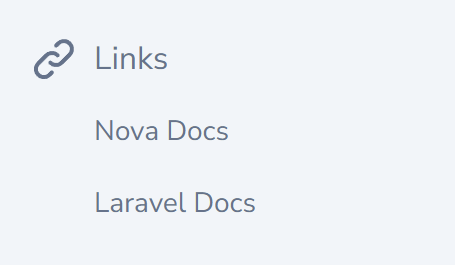

# Add custom links to your nova navigation

[](https://packagist.org/packages/vmitchell85/nova-links)
[](https://packagist.org/packages/vmitchell85/nova-links)


This tool allows you to add a links section in your sidebar.



## Installation

You can install the package in to a Laravel app that uses [Nova](https://nova.laravel.com) via composer:

```bash
composer require vmitchell85/nova-links
```

Next up, you must register the tool with Nova. This is typically done in the `tools` method of the `NovaServiceProvider`.

```php
// in app/Providers/NovaServiceProvider.php

// ...

public function tools()
{
    return [
        // ...
        new \vmitchell85\NovaLinks\Links(),
    ];
}
```

## Usage

There are two ways you can add links:

### Add Links At Runtime

If you would like to add links at runtime you can add them using the `add($linkTitle, $linkUrl, $linkTarget)` function like this:

```php
// in app/Providers/NovaServiceProvider.php

// ...

public function tools()
{
    return [
        // ...
        (new \vmitchell85\NovaLinks\Links())
            ->add('Nova Docs', 'https://nova.laravel.com/docs')
            ->add('Laravel Docs', 'https://laravel.com/docs', '_blank'),
    ];
}
```

### Add Links Using the Config File

You can also add links using the config file. First, publish the config file using the following command:

`php artisan vendor:publish --provider="vmitchell85\NovaLinks\NovaLinksServiceProvider" --tag="config"`

Then open the config file and add your links in the format `'linkName' => 'linkUrl'`

```php
// in config/nova-links.php


return [
    'links' => [
        'Nova Docs' => 'http://nova.laravel.com/docs',
        'Laravel Docs' => 'http://laravel.com/docs'
    ],
];

```